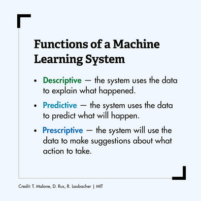
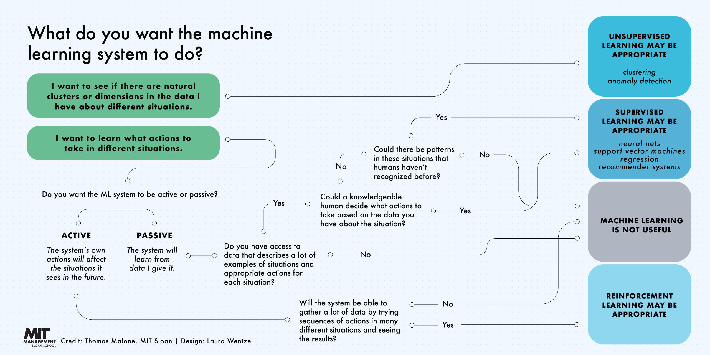

# Machine Learning as defined by MIT
Just some kind of a summary. Check the full article by **Sara Brown** (2021) [here](https://mitsloan.mit.edu/ideas-made-to-matter/machine-learning-explained).

I read the whole thing, I just kept the main parts.

### What is ML?
*"Machine learning is a subfield of artificial intelligence, which is broadly defined as the capability of a machine to imitate intelligent human behavior."*

*"Machine learning takes the approach of letting computers learn to program themselves through experience."*

### What is AI?
*"Artificial intelligence systems are used to perform complex tasks in a way that is similar to how humans solve problems."*

*"The goal of AI is to create **computer models that exhibit intelligent behaviors** like humans" - <u>Boris Katz</u>*

*"This means machines that can recognize a visual scene, understand a text written in natural language, or perform an action in the physical world."*

### There are three subcategories of ML:

1. **Supervised** - models are trained with <u>labeled data sets</u> which allow the models to learn and grow more accurate over time.
2. **Unsupervised** - a program looks for patterns in <u>unlabeled data</u>; finds patterns or trends that people aren’t explicitly looking for.
3. **Reinforcement** - trains machines through trial and error to take the best action by establishing a reward system; helps it learn over time what actions it should take.

### Other Subfields:
**<u>I. Natural Language Processing</u>**

A field of machine learning in which machines learn to understand natural language as spoken and written by humans, instead of the data and numbers normally used to program computers.

**<u>II. Neural Networks</u>**

A commonly used, specific class of machine learning algorithms. Artificial neural networks are **modeled on the human brain**, in which thousands or millions of processing nodes are interconnected and organized into layers.

**<u>III. Deep Learning</u>**

Deep learning networks are neural networks with many layers. The layered network can process extensive amounts of data and determine the **weight** of each link in the network.

### Current Use-cases utilized in the field:
- Recommendation algorithms
- Image analysis and object detection
- Fraud detection
- Automatic helplines or chatbots
- Self-driving cars
- Medical imaging and diagnostics

---

#### Explainability
One area of concern is what some experts call explainability, or the ability to be clear about what the machine learning models are doing and how they make decisions.