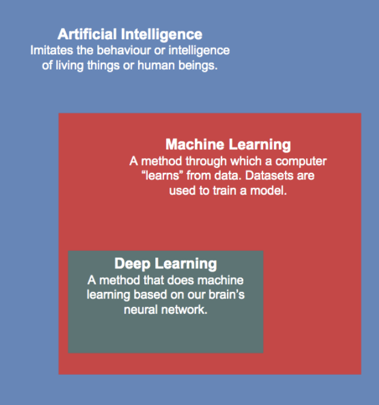
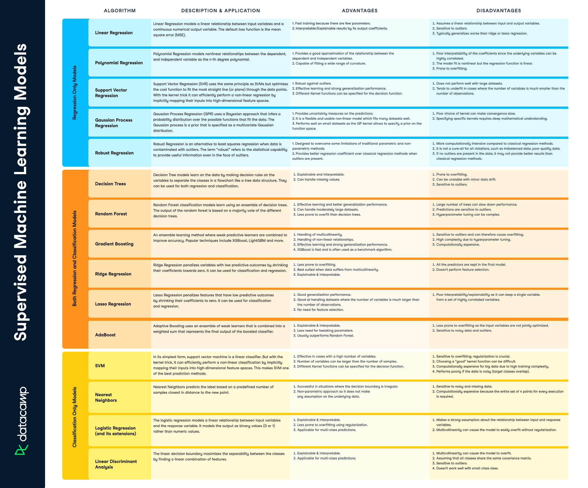
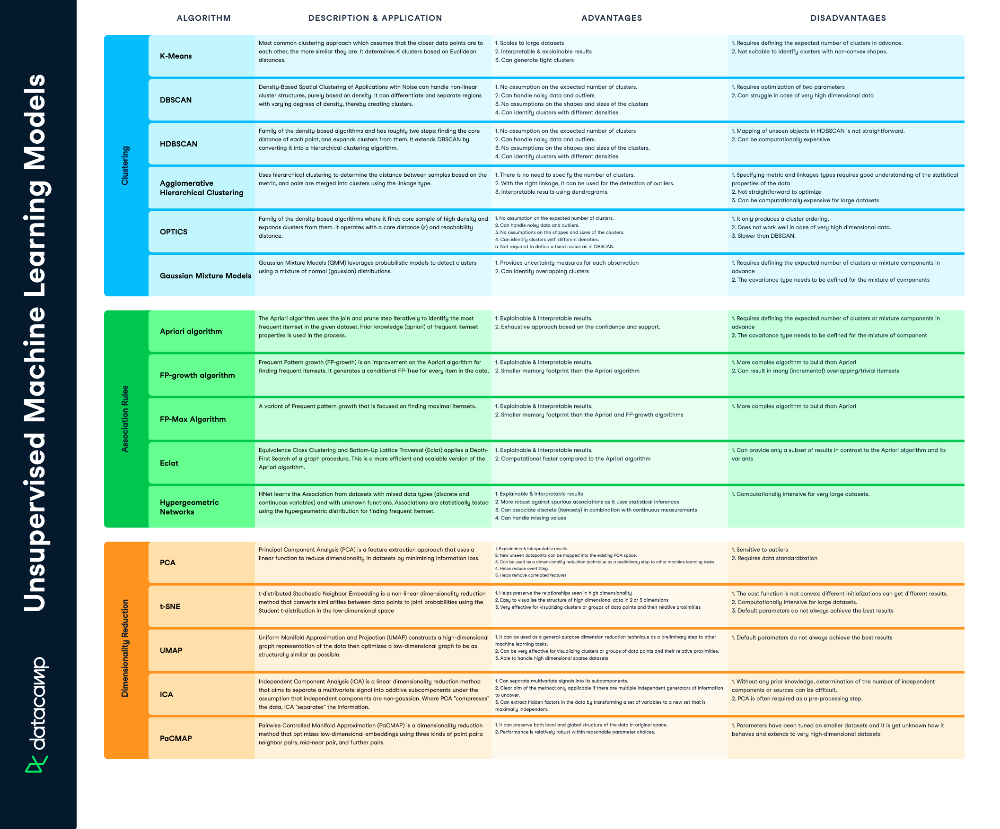

# More on ML

## Strengths & Limitations

### Strengths
1. **Automation** - drives efficiency by automating several routine tasks that previously needed human intervention.
2. **Continuous Improvement** - the ability of algorithms to improve over time; in recommendation systems.
3. **Data-Driven Policies** - Traditional algorithms typically reflect rule-based heuristics which are decided ‘a priori’, i.e., before the fact. Whereas machine learning literally requires learning from the data, that is an ‘a posteriori’, i.e., a data-driven approach to solving problems.

### Limitations
1. **Biases** - algorithms are as susceptible to humans as unintentionally letting biases and prejudices creep into the decision-making process.
2. **Bad Data or Limited Data** - Garbage in, garbage out (GIGO) is an old concept but in the age of machine learning, this saying is more relevant than ever before. Most machine learning models need sufficient data to provide useful predictions. If the data provided is incorrect, the model will learn incorrect relationships. 
3. **Models are Stochastic** - Stochastic models carry some inherent randomness. Therefore, for the same input values, the model may generate different outputs. Most machine learning algorithms are stochastic in nature. This is because reality does contain inherent randomness and incorporating this into models is necessary to build robust and realistic models. 

    > Deterministic models are those where the output of the model is fully determined by the inputs to the model, and the model parameters. 

 

# 7 Steps of ML / Process:

### 1. Gathering data
  1. Data Collection
  2. Data Formatting
  3. Data Pre-Processing

### 2. Data preparation
We also consider *Data Wrangling* a part of this phase, therefore Data Preparation is the part of the process that Data Scientists spend the most time on.

Data Preparation can be split into the following parts:
1. Data Exploration:
    - Explore data
    - Explore the target variable (if we have one)
2. Find relationships between target and other variables

3. Data cleaning
    - Missing values
    - Outlier detection

### 3. Model selection
  1. [Supervised Learning Models - Scikit Learn](https://scikit-learn.org/stable/supervised_learning.html)
        - [Datacamp Cheat Sheet - Full Article Link](https://www.datacamp.com/cheat-sheet/supervised-machine-learning-cheat-sheet)

            > 
  2. [Unsupervised Learning Models - Scikit Learn](https://scikit-learn.org/stable/unsupervised_learning.html)
        - [Datacamp Cheat Sheet - Full Article Link](https://www.datacamp.com/cheat-sheet/unsupervised-machine-learning-cheat-sheet)

            > 

### 4. Training
There are three main things that can go wrong during the training of ML model which contribute to the overall generalization error:
  1. **Approximation Error**
      > the difference between the ideal solution(the true or actual value) and the best solution (the estimated value) we can obtain using an approximation method; the goal of machine learning is to minimize both approximation error and generalization error, so that the model can accurately predict outcomes on new data.
  2. **Estimation Error**
      > the difference between the true distribution of data and the estimated distribution of data; the error or uncertainty that arises when we use sample data to estimate parameters or make predictions about new data; can be divided into two categories: **bias** (underfitting, the difference between the average prediction of a model and the true value) and **variance**(overfitting, the variability of a model's predictions for a given input).
  3. **Optimization Error**
      > occurs when we have a loss function which is too complex, and as a result we don't find the optimal solution. A huge amount of observations can increase the optimization error as well.

### 5. Evaluation

### 6. Hyperparameter Tuning

### 7. Prediction & Deployment
